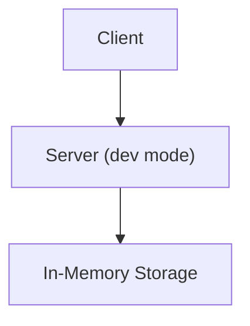
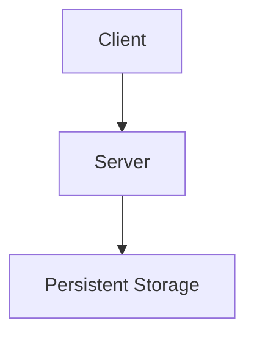
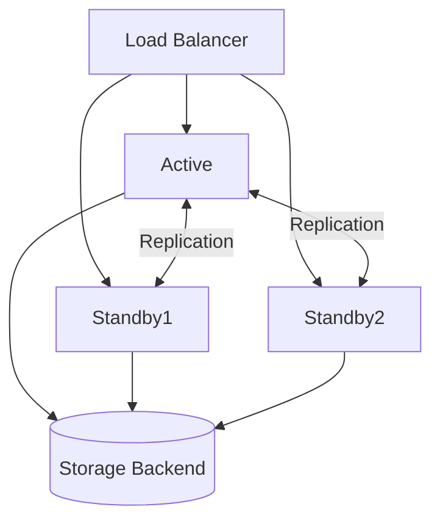

# Architecture

## Component Overview

<!-- Brief description of the main components and how they interact. -->

## Development Deployment

<!-- Single-node, no persistence, for local testing only. -->

## Production Deployment

<!-- Single-node production setup with persistent storage. -->

## High Availability (HA)

<!-- Multi-node cluster for fault tolerance. -->

## Data Flow

<!-- How a typical request flows through the system. -->

---

## Sources

- `<source URL>`
