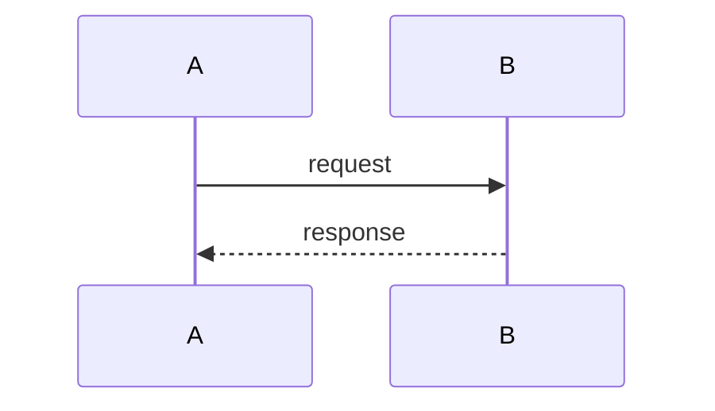

# Use Cases

## Use Case 1: `<name>`

**Problem**: description
**Solution**: description

### Steps

1. Step one
2. Step two

---

## Use Case 2: `<name>`

**Problem**: description
**Solution**: description

---

## Sources

- `<source URL>`
