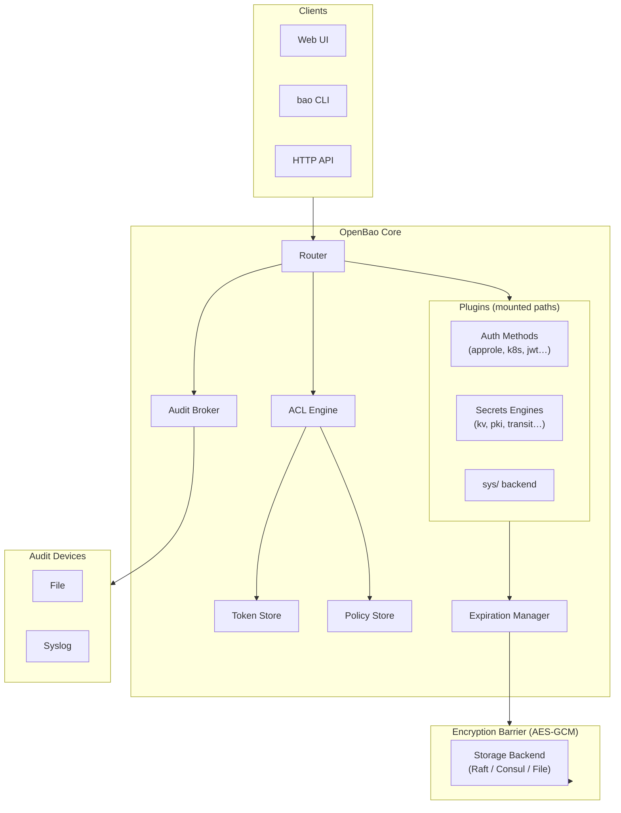
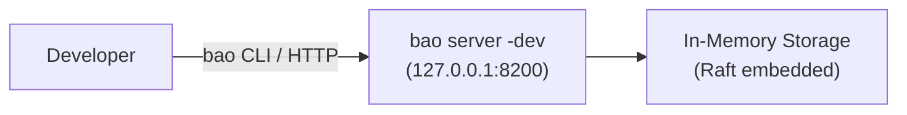
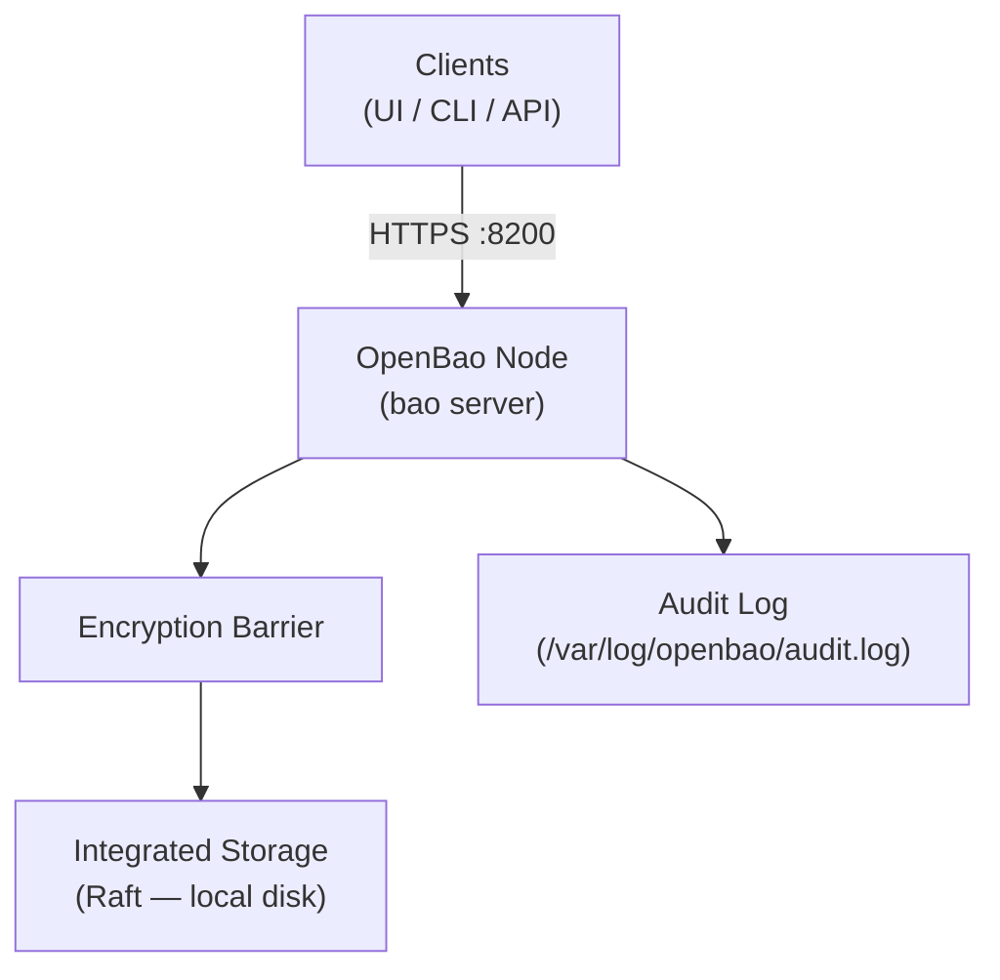
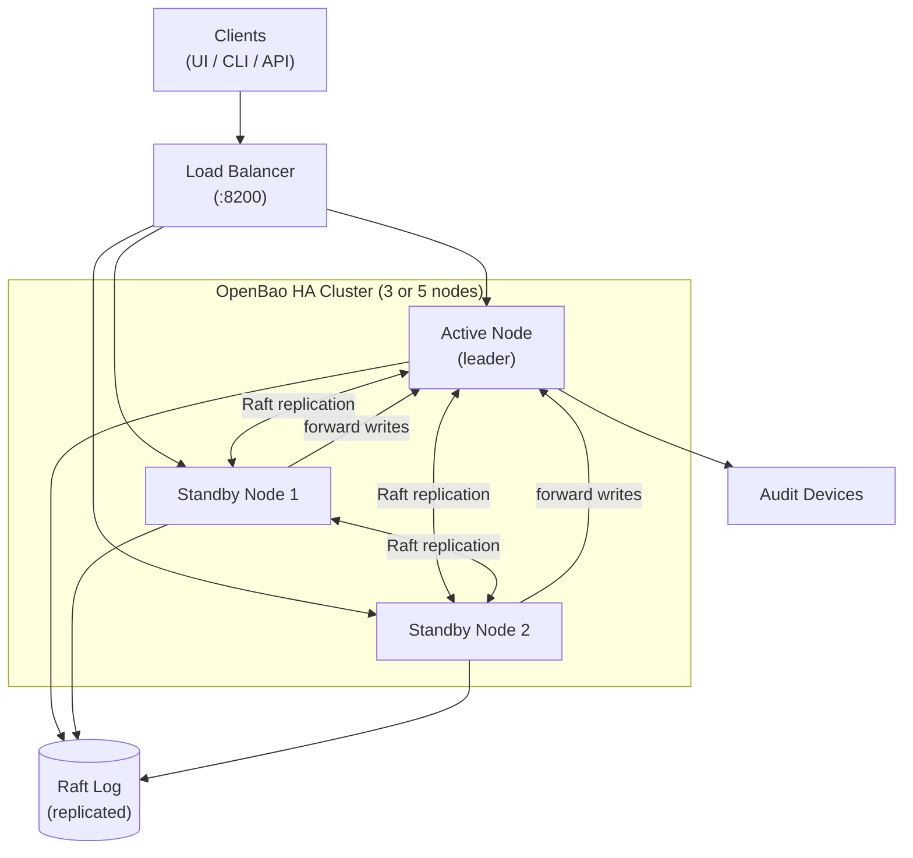
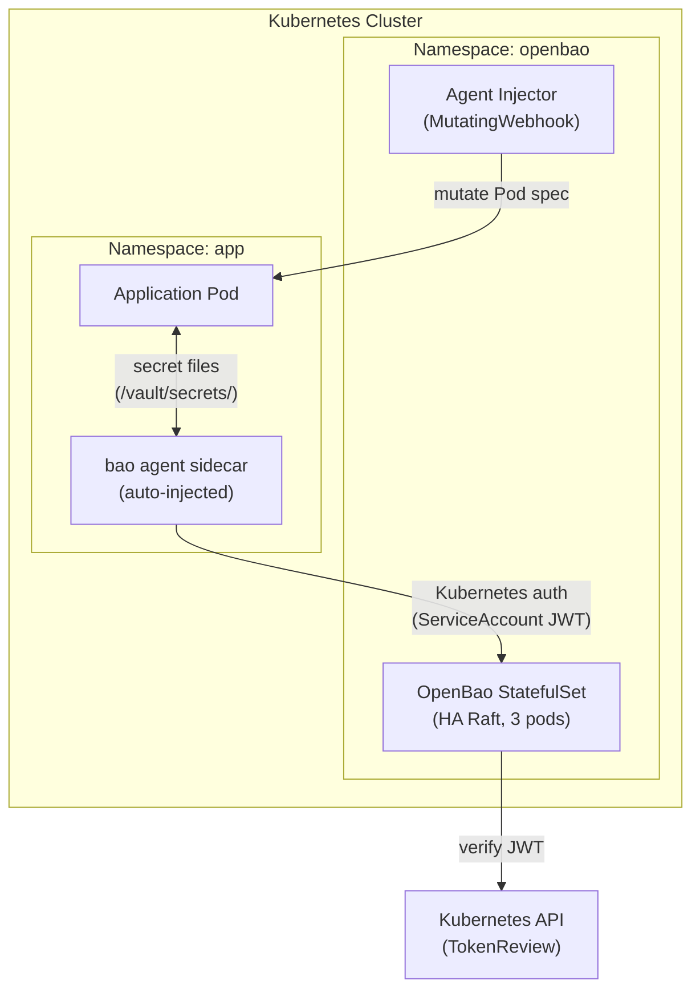

# OpenBao — Architecture

## Internal Components

OpenBao is composed of several distinct layers. From the outside in:



Key points from the official architecture documentation:

- The **barrier** encrypts all data before it reaches the storage backend. The storage backend is
  considered *untrusted*.
- When OpenBao starts it is **sealed**: it knows where storage is but cannot decrypt it. The root
  key must be provided via unseal shares before any operation is possible.
- **Auth methods** validate identity and return a set of applicable policies. A token is then
  generated and managed by the **token store**.
- **Secrets engines** receive a *barrier view* (scoped to a random UUID prefix) — they can only
  read/write their own data, not data from other engines.
- The **expiration manager** handles lease TTLs and automatically revokes secrets whose leases
  expire.
- Every request and response passes through the **audit broker**, which distributes logs to all
  configured audit devices.

---

## Development Deployment

For local testing only. Uses in-memory storage; data is lost on restart. The server
auto-initializes and auto-unseals. Do not use in production.



```bash
# Start a dev server (auto-unsealed, root token printed to stdout)
bao server -dev
export BAO_ADDR='http://127.0.0.1:8200'
export BAO_TOKEN='<root token from output>'
bao status
```

---

## Production Deployment (Single Node)

A single node with persistent Raft storage. Suitable for low-scale or non-critical environments.



Lifecycle:
1. Start `bao server -config=/etc/openbao/config.hcl`
2. Run `bao operator init` (once) — generates unseal keys and initial root token.
3. Run `bao operator unseal` (3× by default with threshold=3) after each restart.

---

## High Availability (HA) with Integrated Raft Storage

The recommended production topology. One active node handles all write requests; standby nodes
forward writes to the active node and can serve read requests (if `disable_standby_reads = false`).



Requirements for HA with Raft:
- Odd number of nodes (3 or 5) to maintain quorum.
- Each node must be able to reach the others on the Raft cluster address (default `:8201`).
- All nodes share the same `cluster_addr` advertised address configuration.
- Each node needs its own data directory (not shared).

### Failure scenarios

| Scenario | Behaviour |
|----------|-----------|
| Active node dies | Raft elects a new leader from standbys; service interruption < 30 s |
| Standby node dies | Cluster remains operational as long as quorum (N/2+1) is maintained |
| Split brain (network partition) | Minority partition becomes unavailable; majority continues |

---

## Kubernetes Deployment

OpenBao can be deployed on Kubernetes using the official Helm chart. The recommended pattern
uses the Vault Agent Injector sidecar for secret injection into Pods.



---

## Sources

- https://openbao.org/docs/internals/architecture/
- https://openbao.org/docs/concepts/seal/
- https://openbao.org/docs/configuration/
- https://openbao.org/docs/platform/k8s/helm/
