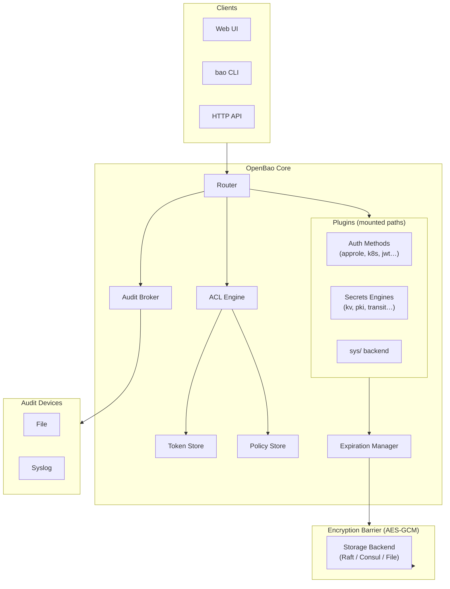
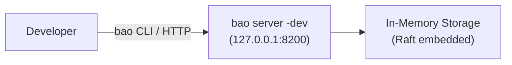
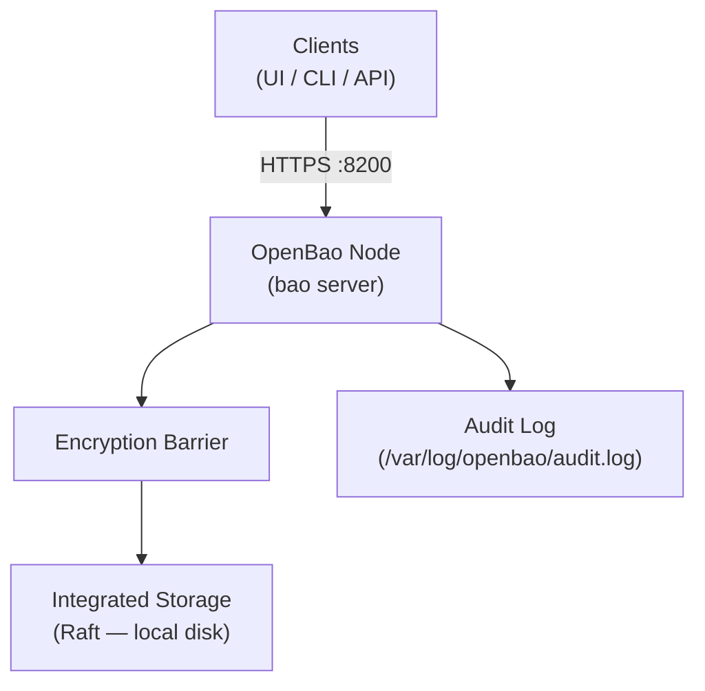
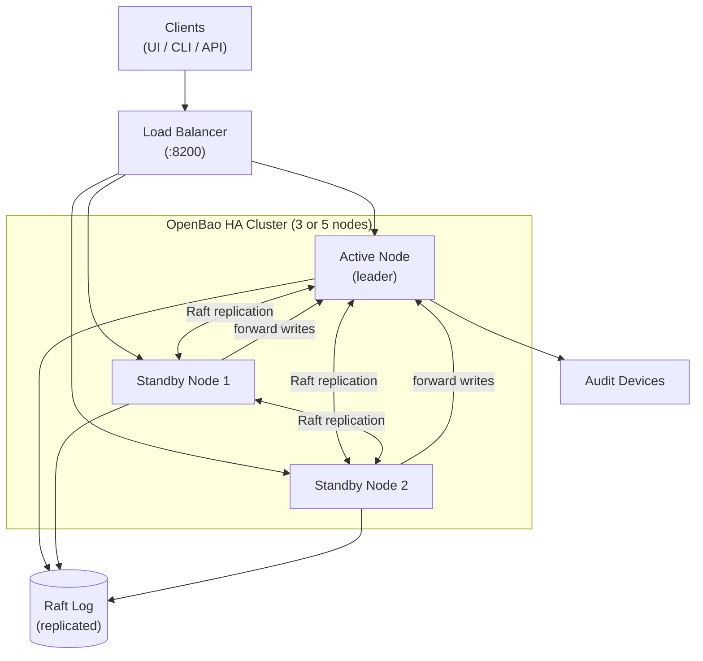
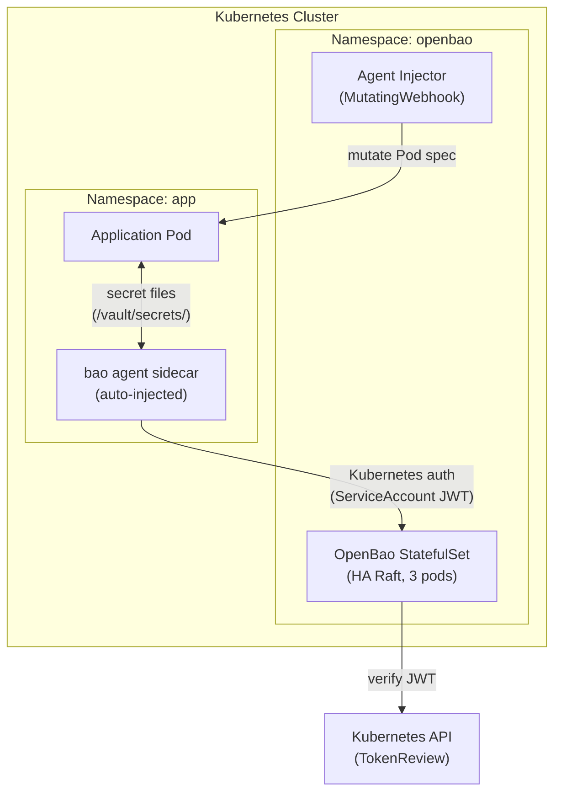

# OpenBao — Architecture

## Internal Components

OpenBao is composed of several distinct layers. From the outside in:



Key points from the official architecture documentation:

- The **barrier** encrypts all data before it reaches the storage backend. The storage backend is
  considered *untrusted*.
- When OpenBao starts it is **sealed**: it knows where storage is but cannot decrypt it. The root
  key must be provided via unseal shares before any operation is possible.
- **Auth methods** validate identity and return a set of applicable policies. A token is then
  generated and managed by the **token store**.
- **Secrets engines** receive a *barrier view* (scoped to a random UUID prefix) — they can only
  read/write their own data, not data from other engines.
- The **expiration manager** handles lease TTLs and automatically revokes secrets whose leases
  expire.
- Every request and response passes through the **audit broker**, which distributes logs to all
  configured audit devices.

---

## Development Deployment

For local testing only. Uses in-memory storage; data is lost on restart. The server
auto-initializes and auto-unseals. Do not use in production.



```bash
# Start a dev server (auto-unsealed, root token printed to stdout)
bao server -dev
export BAO_ADDR='http://127.0.0.1:8200'
export BAO_TOKEN='<root token from output>'
bao status
```

---

## Production Deployment (Single Node)

A single node with persistent Raft storage. Suitable for low-scale or non-critical environments.



Lifecycle:
1. Start `bao server -config=/etc/openbao/config.hcl`
2. Run `bao operator init` (once) — generates unseal keys and initial root token.
3. Run `bao operator unseal` (3× by default with threshold=3) after each restart.

---

## High Availability (HA) with Integrated Raft Storage

The recommended production topology. One active node handles all write requests; standby nodes
forward writes to the active node and can serve read requests (if `disable_standby_reads = false`).



Requirements for HA with Raft:
- Odd number of nodes (3 or 5) to maintain quorum.
- Each node must be able to reach the others on the Raft cluster address (default `:8201`).
- All nodes share the same `cluster_addr` advertised address configuration.
- Each node needs its own data directory (not shared).

### Failure scenarios

| Scenario | Behaviour |
|----------|-----------|
| Active node dies | Raft elects a new leader from standbys; service interruption < 30 s |
| Standby node dies | Cluster remains operational as long as quorum (N/2+1) is maintained |
| Split brain (network partition) | Minority partition becomes unavailable; majority continues |

---

## Kubernetes Deployment

OpenBao can be deployed on Kubernetes using the official Helm chart. The recommended pattern
uses the Vault Agent Injector sidecar for secret injection into Pods.



---

## Deployment Platform Comparison

Secrets managers handle the most sensitive material in an infrastructure. The platform they run
on directly determines the blast radius of a compromise, the attack surface, and operational
complexity. The general security preference ordering is:

```
Bare Metal  >  Virtual Machine  >  Container  >  Kubernetes
(most isolated)                                  (most orchestrated)
```

This does **not** mean Kubernetes is wrong — it means the trade-offs must be understood and
mitigated consciously before choosing it for a secrets manager.

### Security Isolation Stack

```mermaid
graph TB
    subgraph BM["Bare Metal"]
        HW_BM["Hardware / TPM"]
        OS_BM["OS Kernel"]
        BAO_BM["OpenBao Process"]
        HW_BM --> OS_BM --> BAO_BM
    end

    subgraph VM_BOX["Virtual Machine"]
        HW_VM["Hardware"]
        HV["Hypervisor"]
        OS_VM["Guest OS Kernel"]
        BAO_VM["OpenBao Process"]
        HW_VM --> HV --> OS_VM --> BAO_VM
    end

    subgraph CONT["Container (no orchestrator)"]
        HW_C["Hardware"]
        OS_C["Host OS Kernel (shared)"]
        RT["Container Runtime"]
        BAO_C["OpenBao Container"]
        HW_C --> OS_C --> RT --> BAO_C
    end

    subgraph K8S["Kubernetes"]
        HW_K["Hardware"]
        OS_K["Host OS Kernel (shared)"]
        RT_K["Container Runtime"]
        KAPI["API Server + etcd"]
        BAO_K["OpenBao Pod"]
        HW_K --> OS_K --> RT_K --> KAPI --> BAO_K
    end
```



---

### Bare Metal

**Best for**: air-gapped, regulated, or highest-security environments.

| Aspect | Detail |
|--------|--------|
| Isolation | Maximum — no hypervisor, no shared kernel |
| Attack surface | OS + OpenBao process only |
| TPM / HSM support | Yes — hardware-backed unseal keys |
| Cost | High — dedicated hardware per node |
| Flexibility | Low — no live migration, manual provisioning |
| HA | Manual — requires physical network redundancy |

**When to choose**: financial services, government, or any deployment where regulatory
compliance mandates dedicated hardware. Shamir unseal keys can be tied to hardware HSMs
or a TPM chip on the board.

---

### Virtual Machine

**Recommended default for most production deployments.**

| Aspect | Detail |
|--------|--------|
| Isolation | Strong — hypervisor boundary between VMs |
| Attack surface | Hypervisor + OS + OpenBao process |
| Auto-unseal | Cloud KMS (AWS KMS, GCP KMS, Azure Key Vault) |
| Snapshots | Yes — useful for disaster-recovery testing |
| Flexibility | Good — live migration, infrastructure-as-code |
| HA | 3-node Raft cluster across separate VMs / availability zones |

**Pros**:
- Hypervisor provides hard memory isolation; a compromised neighbour VM cannot read OpenBao
  memory directly.
- VM snapshots allow backup and restore of the full state (unseal material must be kept
  separately).
- Compatible with standard `systemd` service management and OS-level hardening (SELinux,
  AppArmor, CIS benchmarks).
- Cloud VMs easily use a cloud KMS for auto-unseal, eliminating manual unseal after restarts.
- Single-purpose guest OS reduces attack surface.

**Cons**:
- VM escape vulnerabilities exist in hypervisors (KVM, Xen, VMware) — rare but not zero.
- On shared physical hosts, a compromised hypervisor can read guest memory.
- Slightly higher resource overhead than bare metal.
- Less dynamic than Kubernetes (no automatic pod rescheduling).

**Recommended configuration**:
- Dedicate VMs to OpenBao — do not co-locate with workloads that consume secrets.
- Place each Raft node on a separate physical host or availability zone.
- Restrict inbound traffic to `:8200` (API/UI) and `:8201` (Raft cluster) at the hypervisor
  or cloud security-group level.

---

### Container (without Kubernetes)

| Aspect | Detail |
|--------|--------|
| Isolation | Weak — shares host OS kernel with other containers |
| Attack surface | Host kernel + container runtime + OpenBao process |
| Persistence | Requires explicit volume mounts for Raft data directory |
| Flexibility | High — reproducible images, fast iteration |
| Production suitability | Low — acceptable for dev/test only |

**Pros**:
- Fast startup, reproducible builds, easy version pinning via image tags.
- Suitable for local development and CI pipelines (replaces `-dev` mode with a real config).

**Cons**:
- Container escapes (e.g. via `runc` or cgroup misconfigurations) give access to all other
  containers on the same host.
- A compromised process in another container shares the same OS kernel.
- No built-in orchestration — restarts, health checks, and scaling are managed manually.

> ⚠️ If running OpenBao in a container, place that container inside a VM. The VM hypervisor
> then provides the isolation layer that the container runtime lacks.

---

### Kubernetes

| Aspect | Detail |
|--------|--------|
| Isolation | Weakest by default — shared kernel, large control-plane attack surface |
| Attack surface | K8s API server, etcd, kubelet, container runtime, OpenBao Pod |
| Circular dependency risk | High — K8s workloads need secrets → OpenBao needs K8s to run |
| Automation | High — Helm chart, HA Raft StatefulSet, rolling updates, K8s auth |
| Production suitability | Acceptable with hardening; preferred for K8s-native organisations |

**Pros**:
- Native integration with the Kubernetes auth method (ServiceAccount JWT auto-rotation).
- Official Helm chart delivers a fully configured HA Raft StatefulSet with Agent Injector.
- GitOps-friendly — declarative configuration fits standard platform engineering workflows.
- `PodDisruptionBudget` and automatic pod rescheduling on node failure.

**Cons**:
- **Blast radius**: a `cluster-admin` privilege escalation in Kubernetes gives direct access to
  OpenBao pods (exec, log streaming, volume mounts).
- **etcd exposure**: Kubernetes Secrets and ServiceAccount tokens used to authenticate to
  OpenBao are stored in etcd. If etcd is compromised, attackers can forge those tokens.
- **Shared kernel**: a container escape from any other pod on the same node can compromise the
  OpenBao process.
- **Circular dependency**: if OpenBao unseals via a Kubernetes Secret, and Kubernetes cannot
  schedule pods without OpenBao (e.g. init containers fetching secrets), a cluster crash
  requires careful manual recovery ordering.
- **Unseal complexity**: auto-unseal via an external cloud KMS is effectively required;
  manually running `bao operator unseal` every time a pod restarts is not operationally
  viable.

**Required hardening for Kubernetes deployments**:
- Run OpenBao pods on **dedicated nodes** with `taints` and `tolerations` to prevent
  co-location with untrusted workloads.
- Apply `NetworkPolicy` to restrict ingress/egress to only necessary consumers.
- Enforce `PodSecurity` Admission with `restricted` profile on the OpenBao namespace.
- Use an external cloud KMS for auto-unseal — never store unseal keys in Kubernetes Secrets.
- Consider a **separate cluster** for OpenBao when the risk of circular dependency is
  unacceptable (e.g. a dedicated "platform services" cluster).
- Enable Kubernetes audit logging and alert on anomalous API calls targeting the OpenBao
  namespace (exec, port-forward, secret read).

---

### Decision Matrix

| Criterion | Bare Metal | VM | Container | Kubernetes |
|-----------|:----------:|:--:|:---------:|:----------:|
| Security isolation | ★★★★★ | ★★★★☆ | ★★☆☆☆ | ★★☆☆☆ |
| Operational simplicity | ★★☆☆☆ | ★★★☆☆ | ★★★☆☆ | ★★★★☆ |
| HA / resilience | ★★★☆☆ | ★★★★☆ | ★★☆☆☆ | ★★★★★ |
| Cloud-native fit | ★☆☆☆☆ | ★★★☆☆ | ★★★☆☆ | ★★★★★ |
| Compliance / regulated | ★★★★★ | ★★★★☆ | ★★☆☆☆ | ★★☆☆☆ |
| Cost efficiency | ★★☆☆☆ | ★★★★☆ | ★★★★☆ | ★★★☆☆ |

**Summary guidance**:
- **Bare Metal** — only when your security policy mandates dedicated hardware or an HSM.
- **VM** *(recommended default)* — best balance of isolation, operational maturity, and cloud
  KMS integration. Start here unless you have a compelling reason not to.
- **Container** — dev/test only; always run inside a VM for any non-trivial environment.
- **Kubernetes** — acceptable for production **if** you apply all hardening controls listed
  above, use dedicated nodes, and address the circular-dependency risk with an external
  auto-unseal KMS.

---

## Sources

- https://openbao.org/docs/internals/architecture/
- https://openbao.org/docs/concepts/seal/
- https://openbao.org/docs/configuration/
- https://openbao.org/docs/platform/k8s/helm/
