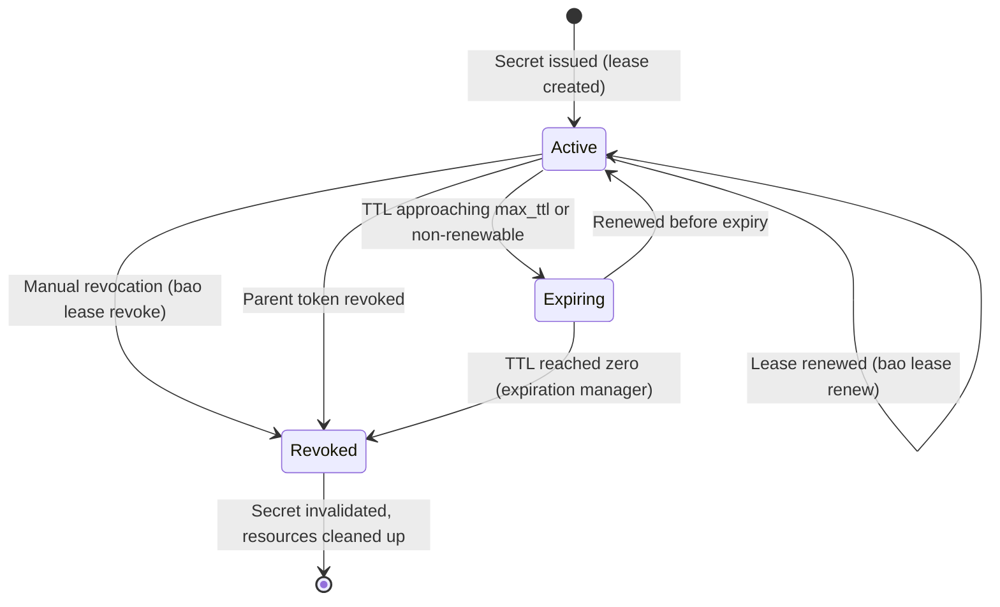
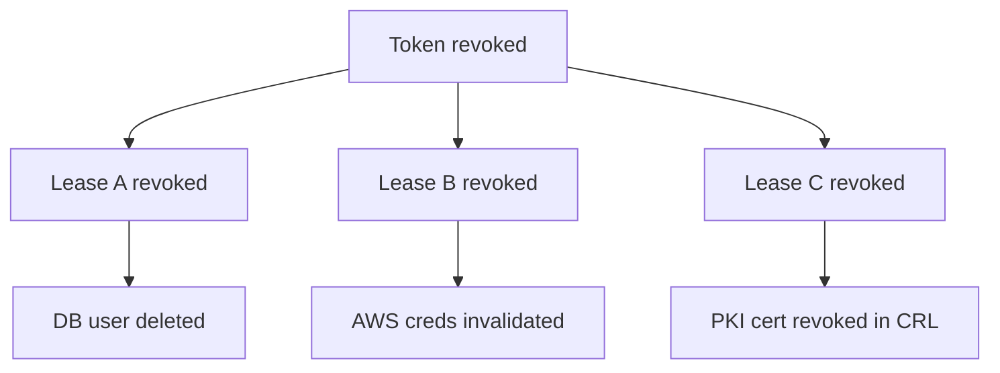
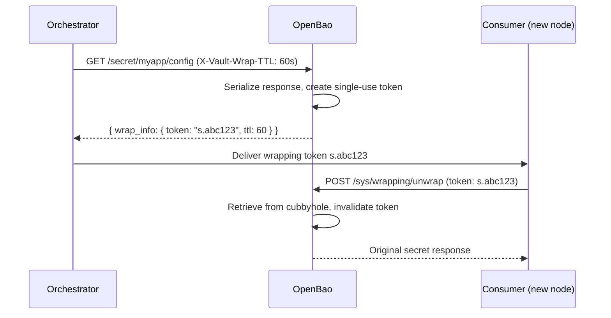

# OpenBao — Secrets Lifecycle

This page covers the complete lifecycle of a secret in OpenBao: from the moment it is issued,
through its active and renewable period, to revocation. It also covers response wrapping, a
mechanism for single-use, tamper-detectable secret delivery.

---

## What is a Lease?

Every dynamic secret and every `service`-type authentication token issued by OpenBao is
accompanied by a **lease**: metadata that includes a Time To Live (TTL), a lease ID, and
renewal information.

OpenBao guarantees the secret is valid for the duration of the TTL. Once the lease expires,
OpenBao automatically revokes the secret and any downstream consumer can no longer assume
it is valid.

**Why leases exist**: they force consumers to check in with OpenBao regularly — either to
renew or to request a new credential. This makes the audit log meaningful, ensures stale
credentials do not linger indefinitely, and makes credential rotation tractable.

> **Note**: The KV secrets engine stores arbitrary static secrets and does **not** issue real
> leases. It may return a `lease_duration` field for compatibility, but KV secrets are not
> revoked by the expiration manager.

---

## Lease Lifecycle



### States

| State | Meaning |
|-------|---------|
| **Active** | Lease is valid; secret can be used; renewal is possible if renewable |
| **Expiring** | TTL is approaching zero; renewal window is open but closing |
| **Revoked** | Lease is invalidated; secret is no longer valid; resources freed (e.g., DB user deleted) |

---

## Lease IDs

When reading a dynamic secret (e.g., `bao read`), OpenBao always returns a `lease_id`. This
opaque string is scoped to the path of the request and is used to manage the lease:

```sh
bao read database/creds/my-role
# Key                Value
# lease_id           database/creds/my-role/abc123...
# lease_duration     1h
# lease_renewable    true
# username           v-root-my-role-xyz
# password           A1B2-C3D4
```

Lease IDs are **path-prefixed**: the prefix of any lease ID is always the path the secret
was read from. This is leveraged for prefix-based revocation.

---

## TTL Mechanics

OpenBao applies two distinct TTL limits to every lease:

| TTL field | Meaning |
|-----------|---------|
| `lease_duration` (creation TTL) | How long the current lease period is valid. Returned on every read/renewal. |
| `max_ttl` | The hard ceiling — the total age of the lease from creation. A lease can never be renewed past this point. |

When a lease is renewed, the consumer can request a specific remaining duration via the
`-increment` flag. This increment is **from the current time**, not from the end of the
existing TTL:

```sh
# Request 1 hour of remaining lease time from now
bao lease renew -increment=3600 database/creds/my-role/abc123
```

The backend may honor the increment exactly, reduce it (e.g., to enforce a lower max TTL),
or ignore it. **Always inspect the renewal response** to determine the actual new TTL.

---

## Renewable vs Non-Renewable Leases

| Type | Behavior |
|------|----------|
| **Renewable** | Can be extended via `bao lease renew` up to `max_ttl` |
| **Non-renewable** | Expires when `lease_duration` reaches zero; no renewal possible |

Whether a lease is renewable is determined by the secrets engine or auth method that issued
it. For example, database dynamic credentials are typically renewable; PKI certificates are
typically not.

The `lease_renewable` field in the secret response indicates the type:

```sh
bao read database/creds/my-role
# lease_renewable    true
```

---

## Renewing a Lease

```sh
# Renew with the default increment
bao lease renew <lease_id>

# Renew and request 2 hours remaining
bao lease renew -increment=7200 <lease_id>
```

When a lease cannot be renewed (non-renewable, or `max_ttl` already reached), the renewal
call returns an error and the lease remains until its TTL expires.

---

## Revoking a Lease

### Single lease

```sh
bao lease revoke <lease_id>
```

Revoking a lease immediately invalidates the secret and triggers any cleanup registered by
the secrets engine (e.g., the database engine deletes the ephemeral database user).

### Prefix-based revocation

Because lease IDs are path-prefixed, operators can revoke an entire tree of secrets in one
operation. This is useful for incident response when a backend or mount is compromised:

```sh
# Revoke all dynamic credentials issued by the database engine
bao lease revoke -prefix database/creds/

# Revoke all Userpass auth tokens
bao lease revoke -prefix auth/userpass/
```

> Prefix revocation requires appropriate ACL policy permissions for the target prefix.

### Automatic revocation

The **expiration manager** runs continuously inside the OpenBao server. When a lease's TTL
reaches zero and it has not been renewed, the expiration manager automatically revokes it
and runs the associated cleanup logic.

When a **token** is revoked, OpenBao also revokes **all leases that were created using that
token**. This cascading revocation ensures no orphaned credentials outlive their parent token.



---

## Response Wrapping

Response wrapping is a mechanism that allows OpenBao to return a **single-use token** instead
of the actual secret. The secret is stored in the token's cubbyhole and can only be retrieved
once by the intended recipient.

### Why it matters

When a secret must travel through an intermediary (e.g., an orchestrator distributing secrets
to new nodes), the intermediary never sees the actual secret value — only the wrapping token.
If the token is intercepted or already consumed when the recipient tries to unwrap it, this
is immediately detectable and can trigger a security alert.

Response wrapping provides three guarantees:
- **Cover**: the wire carries a token reference, not the plaintext secret.
- **Malfeasance detection**: the token can only be unwrapped once; a failed unwrap signals interception.
- **Limited exposure**: the wrapping token has its own TTL, independently from the wrapped secret's TTL.

### How it works



### Creating a wrapped response

Wrapping is requested per-call using the `X-Vault-Wrap-TTL` HTTP header or the `-wrap-ttl`
CLI flag:

```sh
# CLI: wrap the output of a secret read for 5 minutes
bao kv get -wrap-ttl=5m secret/myapp/config

# The response contains wrap_info, not the actual secret
# wrap_info.token     s.XYZ...
# wrap_info.ttl       300
```

### Unwrapping

```sh
bao unwrap s.XYZ...
# Returns the original secret response
```

Or via the API:

```sh
curl -X POST \
  -H "X-Vault-Token: s.XYZ..." \
  https://openbao.example.com/v1/sys/wrapping/unwrap
```

### Validating a wrapping token before unwrapping

Before unwrapping, a consumer can verify the token without consuming it:

```sh
bao token lookup -format=json s.XYZ...
```

Key fields to verify:
- `creation_path`: must match the expected secret path (e.g., `secret/data/myapp/config`)
- `creation_time`: must be recent (not pre-generated by an attacker)
- `ttl`: must be positive (token not yet expired or already consumed)

If the lookup fails (token invalid, already used, or expired), treat this as a security
incident and investigate via the audit log.

---

## Relationship to Tokens

OpenBao tokens themselves follow the same lease model when issued as `service` tokens:

- A `service` token has a TTL and is renewable (subject to `max_ttl`).
- A `batch` token has a fixed TTL and is **not** renewable.
- Root tokens have no TTL and no expiry.

When a parent token is revoked, all its child tokens and all leases created under those
tokens are revoked recursively. This token hierarchy makes it possible to revoke an entire
subtree of credentials in a single operation.

---

## Sources

- https://openbao.org/docs/concepts/lease/
- https://openbao.org/docs/concepts/response-wrapping/
- https://openbao.org/docs/concepts/tokens/
