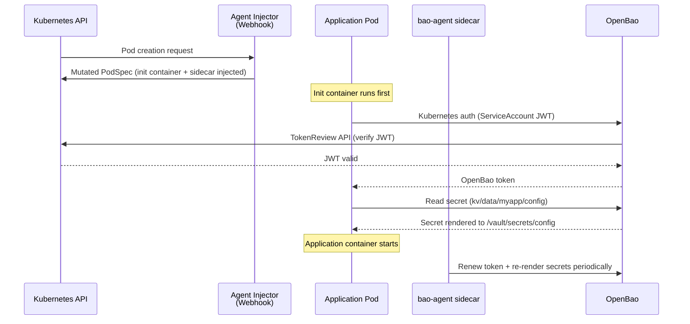
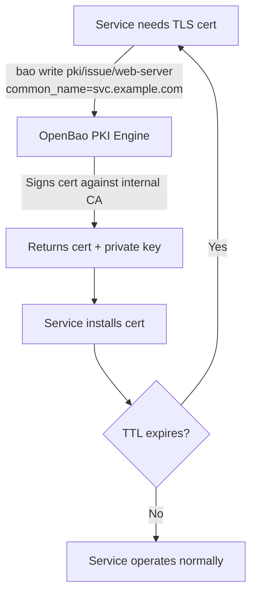
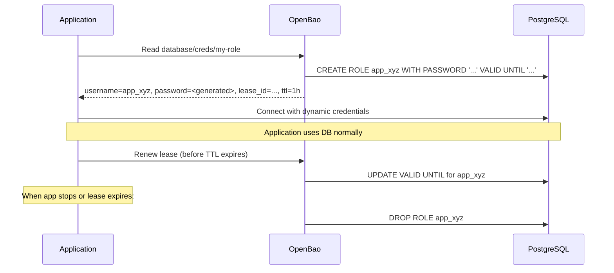
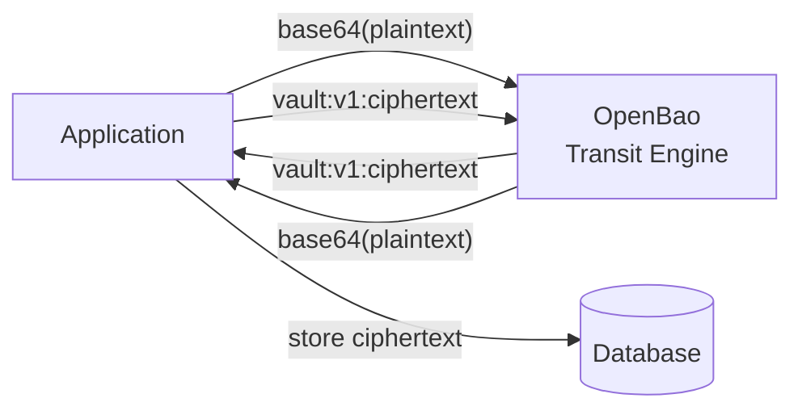
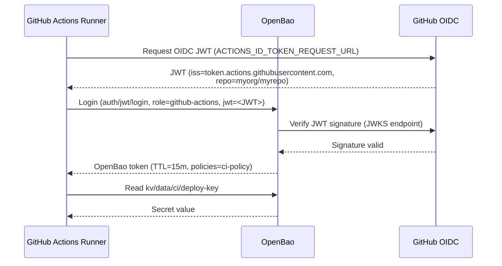

# OpenBao — Use Cases

## Use Case 1: Kubernetes Pod Secret Injection (Agent Sidecar)

**Problem**: A Kubernetes application needs database credentials and API keys at runtime, but
you don't want to store them as Kubernetes Secrets (etcd, base64-encoded, not encrypted by
default without KMS integration).

**Solution**: Use the OpenBao Agent Injector (deployed by the Helm chart). The injector
intercepts Pod creation via a MutatingWebhookConfiguration, injects a `vault-agent-init`
init container and a `vault-agent` sidecar, and writes secrets to a shared `tmpfs` volume
at `/vault/secrets/`.



### Steps

1. Deploy OpenBao with the Helm chart (Agent Injector enabled by default).
2. Enable Kubernetes auth and create a role bound to your app's ServiceAccount.
3. Annotate your Deployment:

```yaml
annotations:
  vault.hashicorp.com/agent-inject: "true"
  vault.hashicorp.com/role: "myapp"
  vault.hashicorp.com/agent-inject-secret-config: "kv/data/myapp/config"
  vault.hashicorp.com/agent-inject-template-config: |
    {{- with secret "kv/data/myapp/config" -}}
    DB_PASSWORD={{ .Data.data.db_password }}
    API_KEY={{ .Data.data.api_key }}
    {{- end }}
```

4. The application reads `/vault/secrets/config` as environment file or config file.

---

## Use Case 2: Internal PKI — Automated Certificate Lifecycle

**Problem**: Managing TLS certificates manually is error-prone; certificates expire unexpectedly,
and issuing new ones requires human intervention.

**Solution**: Use OpenBao's PKI secrets engine as an internal CA. Applications and services
request short-lived certificates programmatically; no long-lived certificates sit around.



### Steps

```bash
# 1. Enable and configure the PKI engine
bao secrets enable pki
bao secrets tune -max-lease-ttl=87600h pki

# 2. Generate internal root CA
bao write -field=certificate pki/root/generate/internal \
  common_name="My Internal Root CA" ttl=87600h > root_ca.crt

# 3. Configure CRL and OCSP endpoints
bao write pki/config/urls \
  issuing_certificates="https://openbao:8200/v1/pki/ca" \
  crl_distribution_points="https://openbao:8200/v1/pki/crl"

# 4. Create a role that allows issuance for your domain
bao write pki/roles/internal-services \
  allowed_domains="svc.example.com" \
  allow_subdomains=true \
  max_ttl="72h" \
  generate_lease=true

# 5. Issue a certificate (done by the service at startup or via cert-manager)
bao write pki/issue/internal-services \
  common_name="myapp.svc.example.com" ttl="24h"
```

---

## Use Case 3: Dynamic Database Credentials

**Problem**: Applications use static, long-lived database passwords that rotate infrequently.
If compromised, an attacker has persistent access. Rotating passwords manually is risky.

**Solution**: Use OpenBao's Database secrets engine. OpenBao creates a unique database user per
request with a short TTL. When the lease expires, OpenBao revokes the user automatically.



### Steps

```bash
# See secrets-engines.md for full Database configuration.
# Request credentials at application startup:
bao read database/creds/my-role
# Returns: username, password, lease_id, lease_duration
```

---

## Use Case 4: Encryption as a Service (Transit Engine)

**Problem**: An application needs to encrypt sensitive fields (e.g., PII in a database) but
should not hold or manage encryption keys.

**Solution**: The Transit secrets engine performs encryption/decryption server-side. The
application sends plaintext (base64-encoded), receives ciphertext — keys never leave OpenBao.



```bash
bao secrets enable transit
bao write -f transit/keys/pii-key

# Encrypt
PLAINTEXT=$(echo -n "SSN:123-45-6789" | base64)
bao write transit/encrypt/pii-key plaintext=$PLAINTEXT
# Returns: ciphertext = vault:v1:...

# Decrypt
bao write transit/decrypt/pii-key ciphertext="vault:v1:..."
# Returns: base64-encoded plaintext

# Key rotation (old ciphertext still decryptable; new encryptions use new key version)
bao write -f transit/keys/pii-key/rotate
bao write transit/rewrap/pii-key ciphertext="vault:v1:..."
```

---

## Use Case 5: CI/CD Secrets (AppRole + GitHub Actions JWT)

**Problem**: CI/CD pipelines need secrets (deploy keys, registry credentials) but storing them
as repo secrets is hard to audit and rotate.

**Solution**: Use JWT auth bound to the CI/CD provider's OIDC token (e.g., GitHub Actions).
No long-lived credentials — the pipeline's identity is its JWT.



```bash
# In your GitHub Actions workflow:
- name: Get OpenBao token
  id: vault
  uses: hashicorp/vault-action@v2
  with:
    url: https://openbao.example.com
    method: jwt
    role: github-actions
    secrets: |
      kv/data/ci/deploy-key key | DEPLOY_KEY
```

---

## Sources

- https://openbao.org/docs/auth/kubernetes/
- https://openbao.org/docs/auth/approle/
- https://openbao.org/docs/secrets/kv/kv-v2/
- https://openbao.org/docs/platform/k8s/helm/
- https://openbao.org/docs/secrets/
