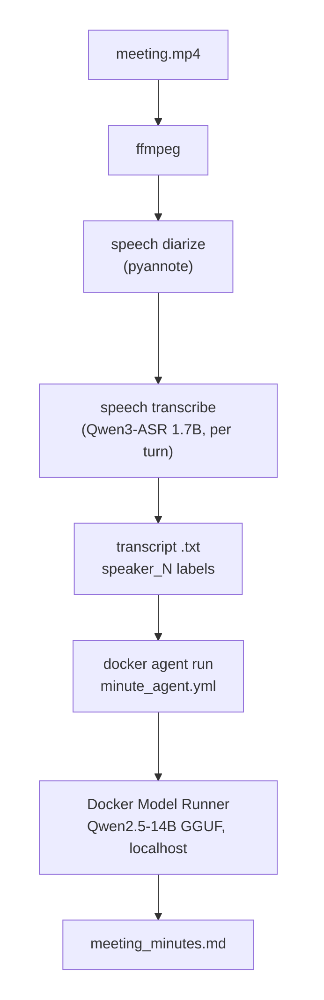

# 📦 Speech Video Transcription and Local Minutes

*Native Apple Silicon transcription with speaker diarization, and fully local meeting minutes via Docker Agent + Docker Model Runner. No audio, transcript, or prompt leaves the machine.*

> 📝 The full story behind this project — the design decisions, the diarization debugging, and the docker-agent bug that got fixed the same day I reported it — is on my blog: [Local AI Meeting Minutes with Docker Model Runner and Docker Agent](https://www.msbiro.net/posts/local-ai-meeting-minutes-docker-agent/).

---

## 📖 Overview

This tool turns a local meeting recording into a speaker-attributed transcript and then into structured Markdown minutes, entirely on-device:



Transcription runs natively (not containerized) because Docker Desktop / Apple Container on macOS do not expose Metal/MPS acceleration to Linux containers; the `speech` CLI uses Apple Silicon directly. Minutes generation runs through **Docker Agent** driving **Docker Model Runner (DMR)** on `localhost` — no API key, no cloud call.

### Key Features

* **Fully local:** audio, transcript, and prompts stay on the Mac.
* **Qwen3-ASR 1.7B** transcription (batch mode) with a domain **context glossary** for cloud-native/security jargon.
* **Speaker diarization** (pyannote) with over-segmentation controls and a phantom-speaker post-filter.
* **Local minutes via Docker Agent:** single-shot for meetings up to ~90 minutes, automatic two-pass map/reduce fallback above that.
* **Italian and English**, auto-detected for the minutes output.
* **Proper-noun corrections map** so garbled brand names come out right in the minutes without rewriting the transcript.

## 🛠️ Prerequisites

- **Hardware/OS:** Apple Silicon Mac. Tested target is MacBook Pro M4 with 32 GB RAM.
- **System tools:**
  - `ffmpeg`: `brew install ffmpeg`
  - `speech` CLI: `brew install soniqo/tap/speech`
- **For minutes generation:**
  - Docker Desktop with Docker Model Runner enabled
  - **`docker-agent` via brew**: `brew install docker-agent`

> **Why brew for docker-agent?** Docker Desktop bundles its own (older) docker-agent and puts it on the PATH. The stream-truncation fix for long local-model prompts ([docker/docker-agent#3298](https://github.com/docker/docker-agent/issues/3298), fixed in v1.90.0) is only in recent builds. `minutes.sh` automatically prefers the brew binary by resolving `brew --prefix docker-agent`, regardless of PATH order. Override with `SPEECH_MINUTES_AGENT_CMD=<path>` if needed.

The default minutes model is pulled automatically on first run:

```bash
docker model pull huggingface.co/bartowski/qwen2.5-14b-instruct-gguf
```

## 🚀 Usage

### Interactive helper (recommended)

```bash
./speech.sh
```

Four steps: input file → language → diarization (yes/no) → minutes. Before generating minutes it opens the transcript so you can map `speaker_N` labels to real names, and asks for optional per-meeting name corrections.

### Direct transcription

```bash
./transcribe_video.sh <video_file> [language_code] [--stream|--batch] [--chunk-seconds N] [--diarize] [--diarize-engine pyannote|sortformer]
```

```bash
./transcribe_video.sh meeting.mp4 it --diarize     # speaker-attributed, Italian
./transcribe_video.sh meeting.mp4 en --diarize
./transcribe_video.sh webinar.mp4 en               # no diarization (single speaker)
```

Output: `<input_basename>.txt` (plus `<input_basename>_diarization.rttm` when diarizing). Batch decoding is the default (more accurate than streaming for recorded files); non-diarized inputs are chunked (default 60 s, `--chunk-seconds` / `SPEECH_CHUNK_SECONDS`) to avoid CoreML large-buffer allocation crashes.

**ASR context glossary.** Recognition is biased toward a built-in glossary of recurring domain terms (Kubernetes, hardened images, DevSecOps, compliance acronyms) plus placeholder company names — replace those with your own recurring brands in `DEFAULT_ASR_CONTEXT`. Append per-meeting terms with:

```bash
SPEECH_TRANSCRIBE_CONTEXT="Acme Corp, Jane Doe, FinOps" ./transcribe_video.sh meeting.mp4 it --diarize
```

### Minutes from a transcript

```bash
./minutes.sh <transcript.txt> [output.md] [--type auto|meeting|webinar] [--model model]
```

```bash
./minutes.sh meeting.txt --type meeting
./minutes.sh webinar.txt --type webinar
SPEECH_MINUTES_LANG=English ./minutes.sh meeting.txt --type meeting   # force output language
```

Output: `<transcript_basename>_minutes.md`. Meeting minutes include participants, executive summary, discussion by topic, decisions (only explicit ones — exploratory meetings get an honest "no formal decision"), an action-items table with owners, open questions, risks, and next steps.

**Single-shot vs chunked.** Transcripts up to `--chunk-chars` (default **80000** chars ≈ a 90-minute meeting) are processed in **one model call** — this produces the best minutes (no structure loss at chunk boundaries). Longer transcripts automatically use a two-pass outline-guided map/reduce fallback. Typical timing on the M4/32 GB: a 47-minute meeting → minutes in ~6 minutes.

**Proper-noun corrections.** The ASR garbles recurring brand names; a built-in `wrong => right` map tells the minutes model the correct spellings (spelling only — it never invents topics from them). Append per-meeting corrections:

```bash
SPEECH_MINUTES_CORRECTIONS="Acme Crop => Acme Corp" ./minutes.sh meeting.txt --type meeting
# disable entirely:
SPEECH_MINUTES_NO_CORRECTIONS=true ./minutes.sh meeting.txt
```

## 🤖 The Docker Agent definition

`minute_agent.yml` is the **live configuration** (not an example): `minutes.sh` runs it directly. It defines two agents on the same DMR model, differing only in output budget, selected per stage with `--agent`:

| Agent | Role | `max_tokens` |
| :--- | :--- | :--- |
| `root` | Final minutes document | 5120 |
| `condenser` | Chunk/outline notes (two-pass fallback) | 768 |

The system prompt lives in `prompts/minute_prompt.md`. Both files are required; custom ones can be passed with `--agent-file` / `--prompt-file` (a custom agent YAML must define the same two agents).

A different model is passed through docker agent's native override (the script does this when `--model` / `SPEECH_MINUTES_MODEL` is set):

```bash
SPEECH_MINUTES_MODEL="hf.co/bartowski/Qwen2.5-32B-Instruct-GGUF:IQ4_XS" ./minutes.sh meeting.txt
```

Do **not** re-add `runtime_flags` / `context_size` to the YAML: forcing them makes docker agent reload the model with a non-default configuration, which triggers the stream-drop failure described below. DMR's default load (32K context for the default model) is correct.

### Reliability: the stream-drop retry

Long silent prefills (a whole transcript in one prompt) can hit a transient idle/proxy connection drop between docker agent and DMR, surfacing as `error receiving from stream: unexpected end of JSON input`. Upstream fix: [docker/docker-agent#3298](https://github.com/docker/docker-agent/issues/3298) → shipped in **v1.90.0** (docker agent retries internally). `minutes.sh` additionally retries the identical prompt itself (`SPEECH_MINUTES_AGENT_RETRIES`, default 3) — the backend's warm KV cache makes the retry's prefill fast enough to succeed. Seeing one `stream dropped ... retrying` line in a run is normal.

### Direct-API mode

The agent path is the default. A lighter path that `curl`s DMR's OpenAI-compatible endpoint (`localhost:12434`) directly is available with:

```bash
SPEECH_MINUTES_USE_AGENT=false ./minutes.sh meeting.txt --type meeting
```

Same model, same privacy; it just bypasses docker agent (uses `SUMMARY`/`FINAL` token caps from the environment instead of the YAML).

## 👥 Diarization tuning

pyannote tends to **over-segment** meeting audio (a 3-person call can produce 10+ speaker labels from crosstalk fragments). Two controls fix this, both with measured defaults:

| Control | Default | Notes |
| :--- | :--- | :--- |
| `SPEECH_DIARIZE_CLUSTER_THRESHOLD` | `0.85` | **Higher = fewer speakers** (measured: 0.40→22, 0.715→10, 0.85→7 on 3-real-speaker audio — the CLI help claims the opposite). |
| `SPEECH_DIARIZE_MIN_SPEAKER_SECONDS` | `8` | Post-filter: speakers with less total speech are reassigned to the temporally nearest real speaker. No text is lost. `0` disables. |
| `SPEECH_DIARIZE_VAD_FILTER` | `true` | Silero VAD pre-filter for non-speech false alarms. |
| `SPEECH_DIARIZE_MIN_SILENCE` | unset | Larger values merge adjacent segments into fewer turns. |

The consolidation is logged, e.g. `Consolidated diarization: 7 speakers -> 4 (reassigned 5 phantom segments under 8s)`.

The transcript starts with a mapping block — edit it before generating minutes:

```text
speaker_0 = Alice
speaker_1 = Bob
```

Unmapped labels stay as `speaker_N` in the minutes; names are never invented.

**Engines:** `pyannote` (default, recommended) is the only engine the wizard offers. `sortformer` is still accepted by `transcribe_video.sh --diarize-engine` for testing, but it is currently broken in the upstream `speech` CLI (fixed-shape CoreML model produces an empty RTTM) — expect it to fail.

## ⚙️ Language handling

| Input | Sent to `speech` |
| :--- | :--- |
| `auto` | no explicit `--language` flag |
| `it` | `it-IT` |
| `en` | `en-US` |
| `it-IT`, `en-US`, `en-GB` | as-is |

Minutes output language is auto-detected (Italian/English) from the transcript; force it with `SPEECH_MINUTES_LANG=Italian|English`.

## 🔧 Environment variables reference

**transcribe_video.sh**

| Variable | Default | Purpose |
| :--- | :--- | :--- |
| `SPEECH_TRANSCRIBE_ENGINE` / `SPEECH_TRANSCRIBE_MODEL` | `qwen3` / `1.7B` | ASR engine and model |
| `SPEECH_TRANSCRIBE_CONTEXT` | — | Appended to the built-in context glossary |
| `SPEECH_TRANSCRIBE_STREAM` | `false` | Streaming decode (batch is more accurate for files) |
| `SPEECH_CHUNK_SECONDS` | `60` | Chunk size, non-diarized path |
| `SPEECH_DIARIZE_*` | see above | Diarization tuning |
| `SPEECH_TRANSCRIBE_EXTRA_ARGS` | — | Extra raw flags for `speech transcribe` |

**minutes.sh**

| Variable | Default | Purpose |
| :--- | :--- | :--- |
| `SPEECH_MINUTES_MODEL` | Qwen2.5-14B GGUF | DMR model (passed as native agent override) |
| `SPEECH_MINUTES_CHUNK_CHARS` | `80000` | Single-shot threshold |
| `SPEECH_MINUTES_LANG` | `auto` | Force output language |
| `SPEECH_MINUTES_CORRECTIONS` / `SPEECH_MINUTES_NO_CORRECTIONS` | — / `false` | Proper-noun corrections |
| `SPEECH_MINUTES_USE_AGENT` | `true` | `false` = direct DMR API path |
| `SPEECH_MINUTES_AGENT_CMD` | auto (brew) | Force a specific docker-agent binary |
| `SPEECH_MINUTES_AGENT_RETRIES` | `3` | Stream-drop retries (identical prompt, warm KV) |
| `SPEECH_MINUTES_UNLOAD_BEFORE_RUN` | `false` | `true` forces a cold model load (reclaims RAM, slower) |
| `SPEECH_MINUTES_DEBUG` | `false` | Keep agent JSONL + docker-agent debug log |
| `SPEECH_MINUTES_KEEP_TMP` | `false` | Keep temp files (always kept on failure) |
| `SPEECH_MINUTES_SUMMARY_MAX_TOKENS` / `SPEECH_MINUTES_MAX_TOKENS` | `768` / `5120` | Token caps (direct-API path; agent path reads them from the YAML) |

## ❓ Notes / FAQ

### Does the minutes workflow call cloud APIs?

No model traffic leaves the machine. Docker Agent reaches Docker Model Runner through Docker Desktop's internal socket endpoint (`model-runner.docker.internal`); the script's pre-warm call and the optional direct-API mode use the local TCP endpoint (`localhost:12434`). Both are local channels to the same local engine, and the model is a local GGUF — no API key exists in the workflow.

One exception to know about: **docker agent sends usage telemetry** (command/session metadata, not transcript content) to Docker by default. Disable it if your privacy posture requires:

```bash
export TELEMETRY_ENABLED=false
```

Also review Docker Desktop telemetry settings if your organization requires it.

### Why is `docker agent` the default path now?

Earlier versions of this tool defaulted to the direct DMR API because docker agent aborted long-prompt runs with `unexpected end of JSON input`. That failure was diagnosed with the maintainers (a transient proxy idle-drop during silent prefill, **not** an agent defect by design) and fixed upstream in v1.90.0; combined with the script's own warm-KV retry, the agent path is reliable and is the showcased configuration. The direct-API path remains available.

### Which model, and can I use a bigger one?

Default is **Qwen2.5-14B-Instruct Q4_K_M** (~8.4 GB): non-reasoning, strong at multilingual structured extraction, fast enough for daily use, and it leaves the Mac usable while running. A 32B at aggressive quantization (IQ4_XS) was tested and was *not* better: ~2x slower, ~3x the memory, and it lost meeting structure the 14B kept. Prefer prompt refinement over model size on 32 GB machines.

### The first run is slow. Is that expected?

Yes: the `speech` CLI downloads its ASR models on first use, and DMR pulls the minutes model (~8.4 GB) on the first `minutes.sh` run. Subsequent runs are fast; the model also stays warm (`keep_alive: 10m`) between calls.

### A run failed — where are the logs?

On any failure the temp dir is preserved (path printed at exit). The agent's raw output is saved as `<output>.agent.jsonl` and stderr as `<output>.error.log`. Re-run with `SPEECH_MINUTES_DEBUG=true` to also get docker-agent's own debug log. Diarization failures keep `<name>_diarization_output.log` / `_error.log`.

## 🧪 Validation

```bash
bash -n transcribe_video.sh speech.sh minutes.sh   # syntax
./transcribe_video.sh sample.mp4 en                # short functional test
```

## 👤 Author

- Matteo Bisi
